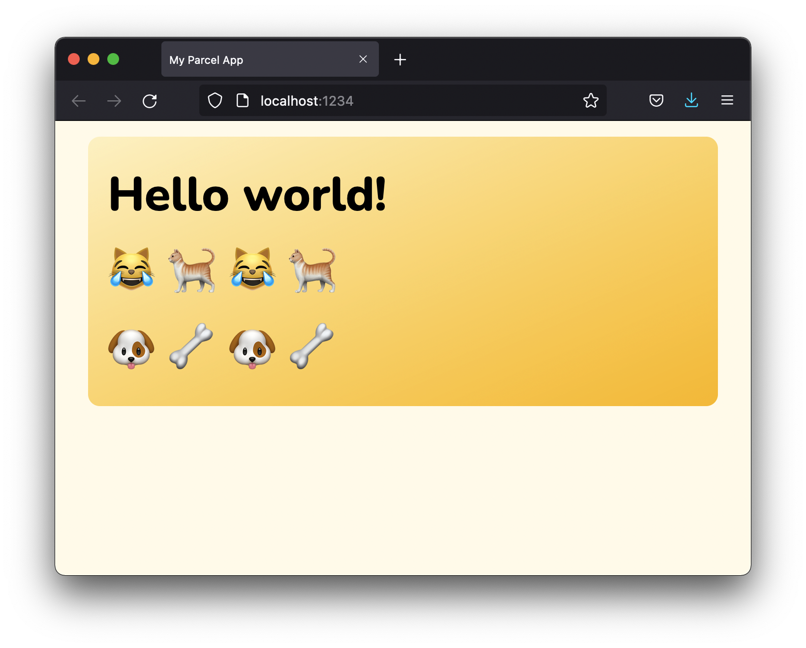
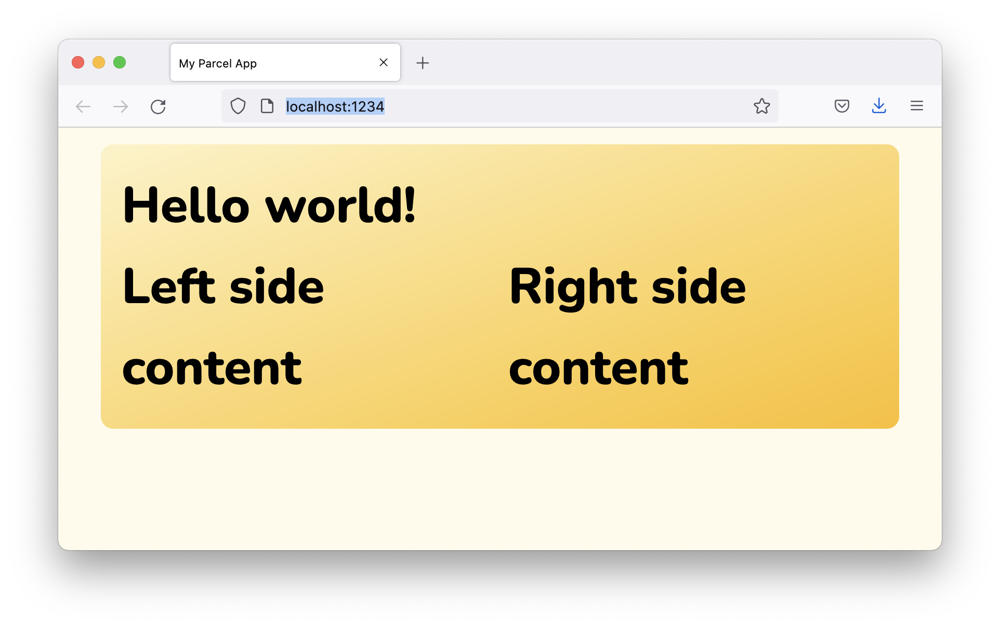
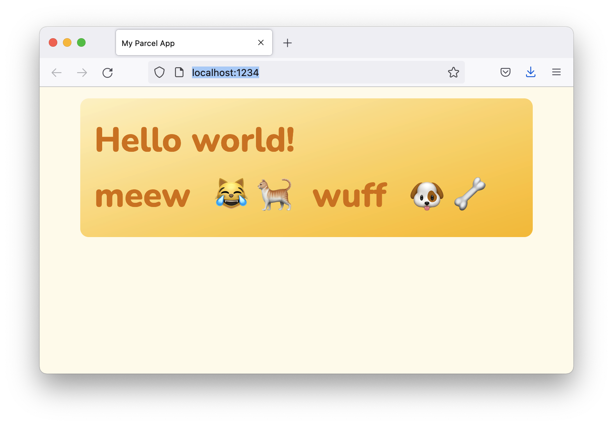

# demo-react-children
Demo of using slots versus react-children




# Installation

```
yarn/npm install
yarn/npm start
```

## The original


```jsx

import { Cat } from './Cat'
import { Dog } from './Dog'
import { Wrapper } from './Wrapper';

export function App() {
  return (
    <Wrapper>Hello world!
      <Cat />
      <Dog />
    </Wrapper>
  )
}
```

## Slots

Without components in place: 

```jsx
import { Slots } from './Slots';
import { Wrapper } from './Wrapper';

export function App() {
  return (
    <Wrapper>
      Hello world!
      <Slots  />
    </Wrapper>
  )
}
```


With components:

```jsx
import { Cat } from './Cat'
import { Dog } from './Dog'
import { Wrapper } from './Wrapper';
import { Slots } from './Slots'

export function App() {
  return (
    <Wrapper>
      Hello world!
      <Slots left={Cat} right={Dog} />
    </Wrapper>
  )
}
```



## Children

```
import { Cat } from './Cat'
import { Dog } from './Dog'
import { JustChildren } from './JustChildren'
import { Wrapper } from './Wrapper';

export function App() {
  return (
    <Wrapper>
      Hello world!
      <JustChildren>
        <Dog />
        <Cat />
      </JustChildren>
    </Wrapper>
  )
}
```

